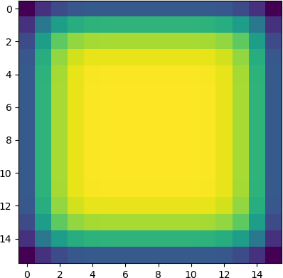
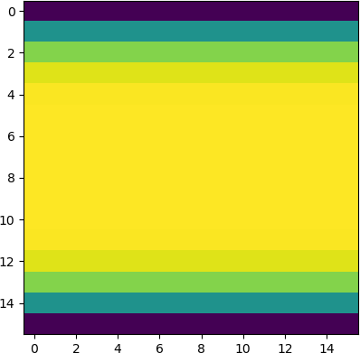

# Horizontal Circular Convolution

This is a PyTorch implementation of horizontal circular convolution adaptable to panoramic images.

## Example

The figures below visualize gradients in 16x16 image space after proceeding multiple convolutions. The input image and convolution filters are initialized with a constant number of 1.

```
python main.py
```

| Normal convolution with zero padding | Horizontal circular convolution |
| :----------------------------------: | :-----------------------------: |
|                  |            |

## References

In our paper [1], we adapted this horizontal circular convolution on pseudo depth/reflectance images generated from 3D LiDAR dataset [2].

1. Learning Geometric and Photometric Features from Panoramic LiDAR Scans for Outdoor Place Categorization<br>
K. Nakashima, H. Jung, Y. Oto, Y. Iwashita, R. Kurazume, O. M. Mozos<br>
*Advanced Robotics*, Vol.32, No.14, 2018

2. Multi-modal Panoramic 3D Outdoor Datasets for Place Categorization<br>
H. Jung, Y. Oto, O. Mozos, Y. Iwashita, R. Kurazume<br>
In *International Conference on Intelligent Robots and Systems (IROS)*, 2016
